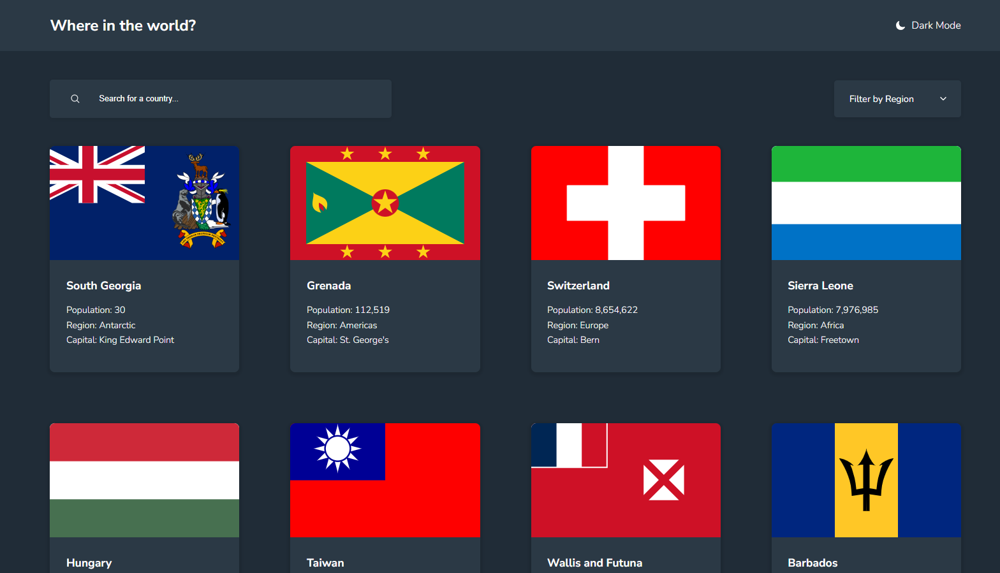

# Frontend Mentor - REST Countries API with color theme switcher solution

This is a solution to the [REST Countries API with color theme switcher challenge on Frontend Mentor](https://www.frontendmentor.io/challenges/rest-countries-api-with-color-theme-switcher-5cacc469fec04111f7b848ca). Frontend Mentor challenges help you improve your coding skills by building realistic projects. 

## Table of contents

- [Overview](#overview)
  - [The challenge](#the-challenge)
  - [Screenshot](#screenshot)
  - [Links](#links)
- [My process](#my-process)
  - [Built with](#built-with)
  - [What I learned](#what-i-learned)
  - [Continued development](#continued-development)
- [Author](#author)

## Overview

### The challenge

Users should be able to:

- See all countries from the API on the homepage
- Search for a country using an `input` field
- Filter countries by region
- Click on a country to see more detailed information on a separate page
- Click through to the border countries on the detail page
- Toggle the color scheme between light and dark mode *(optional)*

### Screenshot



### Links

- Solution URL: [Frontendmentor.io](https://www.frontendmentor.io/solutions/responsive-rest-countries-api-website-WsWt77sy9h)
- Live Site URL: [Netlify](https://countries354.netlify.app)

## My process

### Built with

- Semantic HTML5 markup
- CSS variables
- IntersectionObserver API
- Typescript

### What I learned

To improve performance, I decided to use the IntersectionObserver API. First, I asked ChatGPT about general information and how to use it before implementing  it myself to save some time. Using this API html elements can be rendered when the enter the viewport which improves performance because in this case, only some cards needed to be rendered whereas most of the cards did not have to be rendered.

```js
const observer = new IntersectionObserver(
(entries, obs) => {
        entries.forEach(entry => {
          ...
        });
    },
    {
        root: null,
        rootMargin: "0px",
        threshold: 0.1,
    }
);
```

### Continued development

In the future, I want to continue using Typescript and if suitable the IntersectionObserver API. In my opinion, Typescript provides a great developer experience and the IntersectionObserver API comes in handy sometimes to improve performance. Nevertheless, I now want to complete the [Javascript Course by TheOdinProject](https://www.theodinproject.com/paths/full-stack-javascript/courses/javascript) to improve my knowledge and understanding of this programming language before deep diving into Typescript.

## Author

- Github - [LucaJahnen](https://github.com/LucaJahnen)
- Frontend Mentor - [@LucaJahnen](https://www.frontendmentor.io/profile/LucaJahnen)